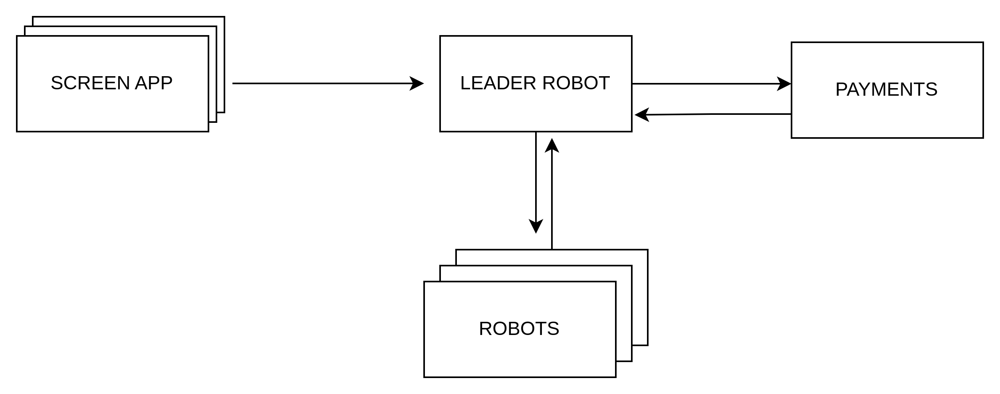
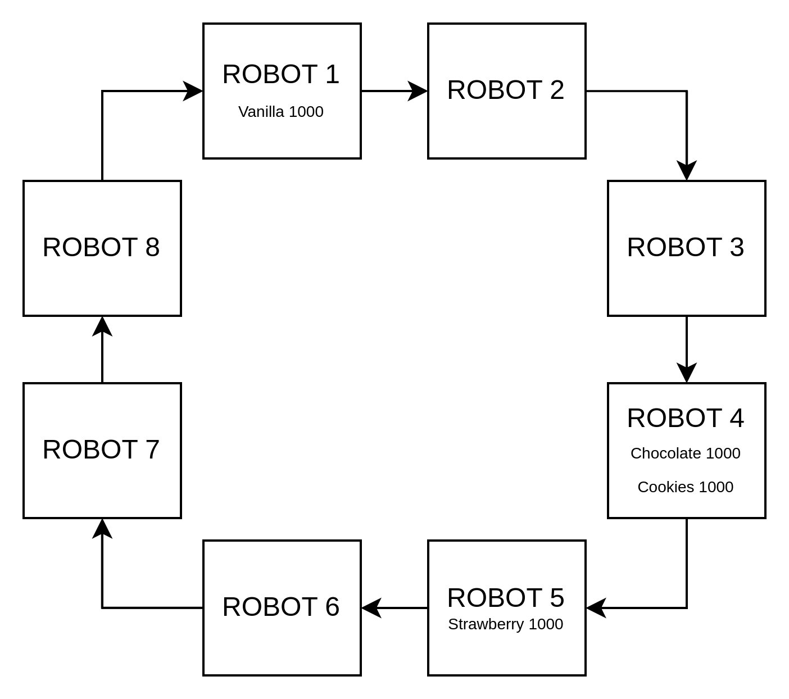
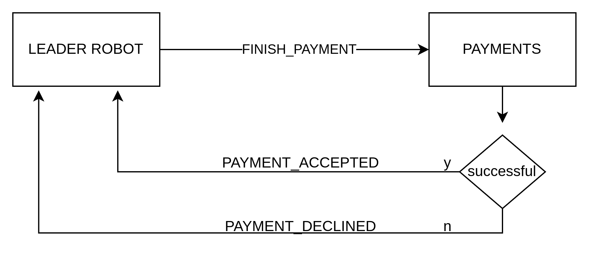
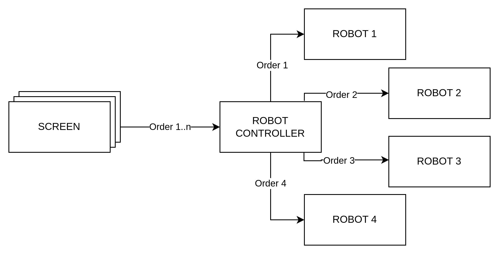
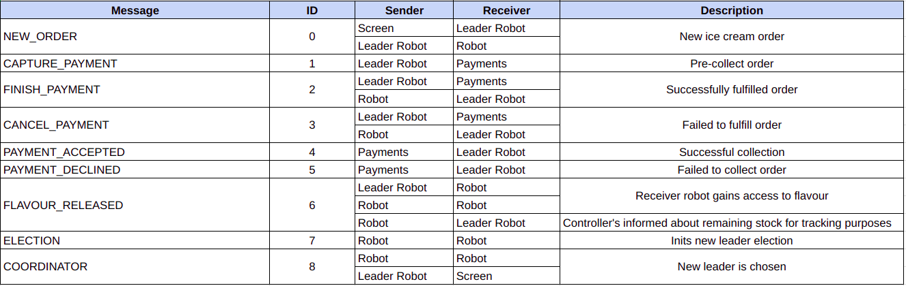
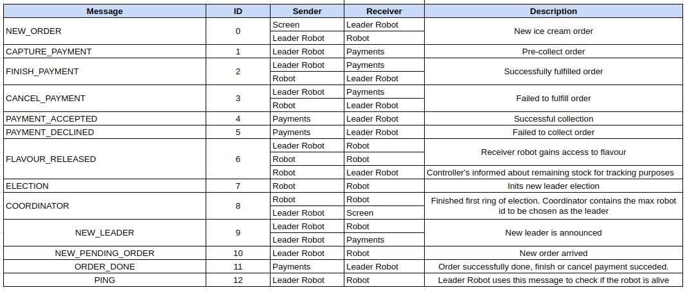

# Diseño inicial (1° entrega)
Nuestro diseño constará de 3 aplicaciones:
1. Screen
2. Robots
3. Payments

A continuación se detallan las funcionalidades de cada una de ellas.

# App 1: Screen 
La pantalla es la interfaz con los clientes, quienes generan ordenes de pedido según un archivo de pedidos simulado. Los pedidos 
se leen de archivos. 
Se ofreceran varios gustos y tamaños posibles de contenedor. EL contenedor es donde se le va a dar el helado al cliente.
Se encarga de enviar los pedidos al robot líder.

# App 2: Robots
Los robots recibirán un pedido hecho por un cliente y deberán obtener los ingredientes necesarios para llenar el contenedor.
El tiempo para simular cada pedido será igual al tamaño del contenedor (mientras más grande el contenedor, más tiempo tardará en prepararse).
Existirá un robot líder encargado de asignar los pedidos a los robots trabajadores, que estarán trabajando simultáneamente para despachar los pedidos asignados.

# App 3: Payments
Es el servicio encargado de capturar y efectuar el pago.
Consideraciones:
- Solamente se le cobrará en la tarjeta si efectivamente se pudo completar su pedido.
- Se puede rechazar la tarjeta aleatoriamente con una probabilidad. En ese caso se cancela el pedido (no se prepara).
- El cobro/cancelacion es al momento de la entrega.

# Esquema general

# Diseño
Los robots son una aplicación de muchos robots que se comunican entre sí por sockets. De esta manera, en caso de que el robot líder se caiga, otro robot tomará su lugar (se elegirá uno nuevo con el algoritmo de anillo). Cada robot es un actor, y son procesos diferentes.

La cantidad de pantallas es fija (N) y son distintas instancias del mismo programa. Las mismas se dedican a hacer el pedido. Si se cae una,
habiendo un pedido en curso que fue generado por esa pantalla, el mismo continúa elaborándose (las pantallas y los robots son independientes entre sí).  

Habrá más o igual cantidad robots que pantallas. La cantidad de robots es fija (M). 

Siempre se cumple que M >= N. Se podrán procesar varios pedidos que fueron generados por una misma pantalla simultáneamente.

El robot lider inicialmente manda a retener el pago a Payments. Puede ocurrir que:
- El pago se retiene correctamente (exitoso). En este caso, se comienza a elaborar el pedido.
- El pago no se retiene correctamente (error). En este caso, se aborta la transacción (la orden).

Cuando el robot líder recibe que pago fue retenido exitosamente, se la asigna a un robot trabajador para que elabore el pedido. 
Puede ocurrir que:
- El pedido fue generado correctamente por lo que el robot controlador le indica al servicio de pagos que efectúe el mismo. 
- El pedido falla por falta de stock, el robot controlador le indica a pagos que cancele la retención y se aborta todo el pedido.

Las pantallas se comunican por TCP con el robots líder utilizando sockets. Hasta que un robot se libere, el líder no envía más pedidos y los acumula en una cola.
Cuando un robot finaliza un pedido, le avisa al robot controlador.

## Mensajes a utilizar:

## Decisiones tomadas
- Cada gusto podrá ser utilizado solamente por un robot a la vez.
- Cada gusto de helado tiene un stock inicial y se va descontando a medida que se preparan los pedidos. Si un gusto queda sin stock, se deberá cancelar el pedido que lo necesite.
- Cuando timeoutea un robot (tarda más de X segundos en realizar un pedido) el robot lider cierra la conexión con el mismo, asumiendo que se cayó. En caso de que un pedido falle por un robot caído, se reintenta con otro.
- Si se cae el robot líder, sus pedidos no serán cancelados dado que todos los robots conocen los pedidos existentes.
- Cuando se elige un nuevo lider, la nueva dirección de este es notificada las pantallas y a los demás robots mediante un mensaje COORDINATOR. 
- Los gustos de helados son tokens que se van pasando entre los robots. Cada token contiene: gusto, stock restante.
- Cada vez que un robot libera un token (gusto de helado), además de liberarlo para otro robot, le informa al robot controlador acerca de la cantidad de stock con la que liberó el gusto de helado. De esta forma, el controlador puede mantener un registro de la cantidad de stock de cada gusto y, como no prepara pedidos, no genera problemas de sincronización. 
- En caso de que un robot se caiga con un token tomado, el robot controlador detectará por un timeout que se perdió el gusto de helado e iniciará el pasamanos con la última información del stock que recibió. Adicionalmente, este mensaje actúa como un PING que le permite a los robots identificar si el controlador se cayó, permitiendo así elegir un nuevo líder en aquellos casos en los que no hay ningún pedido realizándose.
- Los pedidos contienen, por cada contenedor encargado: gustos y tamaño contenedor. La cantidad de cada gusto será el tamaño de contenedor / la cantidad de gustos.
- Los contenedores disponibles son de: 250g, 500g, 1000g. Con precios correspondientes de: $3000, $5500, $10000.
- Los gustos de helado disponibles son: vainilla, chocolate, frutilla, cookies. Todos comienzan con el mismo stock de 4000g.
- Las ordenes de un robot que se cae, son reasignadas por el lider a otro robot.

_Este modelo inicial está sujeto a posibles cambios durante la implementación del mismo._

### Integrantes: Gastón Frenkel, Carolina Mauro, Valentina Adelsflugel.

# Diseño final (2° entrega)
## Cambios realizados respecto al diseño original

- En vez de que _hasta que un robot se libere, el líder no envíe más pedidos_, se envían siempre, estén ocupados o no, ya que al ser actores, los van a ir acumulando en su mail box y procesando a medida que se termine con una orden.
- Cuando se elige un nuevo lider, la nueva dirección de este es notificada las pantallas y a los demás robots mediante un mensaje NEW LEADER. Este mensaje también se le envía a Payments para que sepa cuando el lider cambia.
- Agregamos otros mensajes nuevos:
  - `OrderDone`: lo envía Payments al robot controlador para que este sepa que el pago fue completado. 
  - `NewPendingOrder`: se envía a los robots para que sepan que hay una nueva orden pendiente.
  - `Ping`: lo envía el robot lider a los robots cuando detecta que puede existir alguno que este caído.

- Los gustos de helados son un sólo token que se va pasando entre los robots. Antes, habíamos pensado en un token por gusto, pero era complicado de implementar y agregaba mucha complejidad que no consideramos necesaria.
- No utilizamos los precios de los contenedores en la implementación, ya que no era necesario para el funcionamiento del sistema.

## Casos de uso: caidas soportadas
### Robots
- La detección de la caída del líder se logra a partir del mensaje FlavoursReleased, el cual es informado por el poseedor de los sabores al líder y actúa como un health check o ping.
- Caída del lider una y varias veces. Si bien, si el lider se cae antes de que Screens inicie, se eligirá uno nuevo, Screens no funcionará porque siempre iniciará con el lider caído que estaba en el archivo de configuración. Por esto, vamos a asumir que las caidas se darán durante el procesamiento de las ordenes y/o después.
- La detección de la caída de un robot heladero la hace el lider. Cuando inicia el actor, se ejecura en paralelo la función `ping_robots` donde se un hilo que espera recibir el Stock de los sabores por un channel. El extremo tx lo usa el lider cada vez que recibe el mensaje `FlavoursReleased` para enviar el mensaje con el stock recibido al hilo.
Si no se recibe el mensaje con el stock luego de 5 intentos, es posible que haya un robot caído y que tenga el token. Se envia un mensaje `Ping` a todos los robots para verificar si están caídos. Con aquellos que no se logra comunicar, los da por caídos y asigna sus pedidos a otros robots. Reinicia el token con el stock que tenía el robot caído.

- Caída de un robot heladero, manejando correctamente sus ordenes pendientes.

### Screens

- La caída de un robot heladero no influye en las screens.
- La caída del robot líder imposibilita que screens continúe enviando órdenes. Es por esto que una vez finalizado el proceso de elección, el nuevo líder le envía un mensaje de NewLeader a cada screen y estas se encargan de generar una nueva conexión con dicho líder. Esto se logra a través de la pata RecvScreen la cual se encarga de recibir el nuevo puerto y actualizar el stream, y la pata SendScreen que se encarga de enviar órdenes a través del stream actualizado. 

### Payments
- Asumimos que payments nunca se caerá. Es por eso, que los mensajes de Payments al Lider contienen la Orden, para no perder las ordenes en caso de que el lider se caiga antes de capturar el pago.

# Video explicativo
[Video phelados](https://drive.google.com/drive/folders/14Zi4BF1ekb7bhHeIwHDo5auZThyk51LV?usp=sharing)